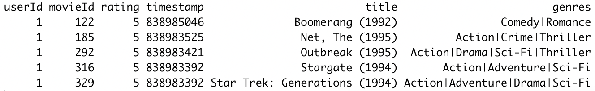
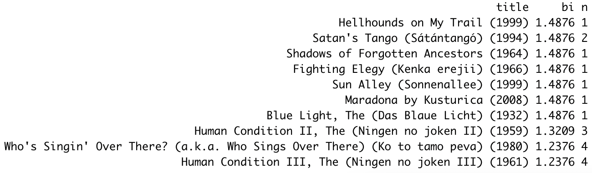
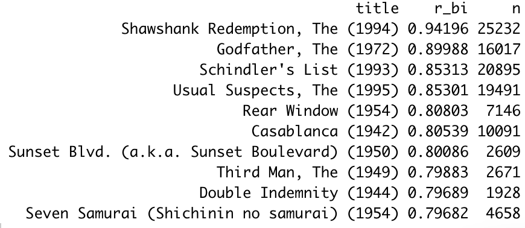

```{r setup, include = FALSE}
if(!require(knitr)) install.packages("knitr", repos = "http://cran.us.r-project.org")
library(knitr)
opts_chunk$set(
	echo = FALSE,
	collapse = TRUE,
	warning = FALSE,
	message = FALSE,
	out.width = "50%",
	fig.align = "center"
)
```


## Introduction


The Big Tech companies use recommendation systems to provide customized suggestions of products to users (Koren 2008, 426; Rocca 2019). These algorithms aim to enhance user experience and build customer loyalty (Koren 2008, 426). They are commonly developed using content-based methods founded on user and product information and collaborative filtering methods based on user-product interactions (Rocca 2019).

In 2006, the streaming service company Netflix offered USD 1,000,000 to any team that managed to come up with an algorithm that improved on their internal recommendation system, Cinematch, by 10% or more. The hybrid team of KorBell, Big Chaos and Pragmatic Chaos - Bell-Kor's Pragmatic Chaos - triumphed the challenge (Van Buskirk 2009). The team utilized advanced methods of collaborative filtering, restricted Boltzmann machine and gradient-boosted decision trees, yet Koren (2008, 434; 2009, 9) of team KorBell emphasized the significance of content information from the baseline predictors in capturing the main biases in the dataset and refining the prediction of the algorithm.

Following this lead, this project aims to develop a modest recommendation system that is based on content information from baseline predictors in a similar dataset of the movie recommender MovieLens and that predicts future movie ratings of users with a root mean squared error (RMSE) rate of less than 0.86490. In the succeeding sections, we examine the dataset and user preferences then subsequently build algorithms to develop the recommendation system.

This undertaking is part of the capstone in the [Professional Certificate Program in Data Science of Harvard Online](https://www.harvardonline.harvard.edu/course/data-science-professional-certificate).


## MovieLens 10M Dataset


The [MovieLens 10M Dataset](https://grouplens.org/datasets/movielens/10m/) was composed of 10,000,054 movie ratings from users with 20 ratings or more (GroupLens, n.d.; Harper and Konstan 2015). The dataset was downloaded and subjected to wrangling using an initial code in the language R provided by Harvard Online, which standardized its formatting and partitioning into 90% edx set and 10% final holdout test set across all projects.

```{r}
if(!require(tidyverse)) install.packages("tidyverse", repos = "http://cran.us.r-project.org") # require() checks if the package exists
if(!require(caret)) install.packages("caret", repos = "http://cran.us.r-project.org")

library(tidyverse)
library(caret)

# MovieLens 10M dataset:
# https://grouplens.org/datasets/movielens/10m/
# http://files.grouplens.org/datasets/movielens/ml-10m.zip

options(timeout = 120) # timeout in seconds for some Internet operations

dl <- "ml-10M100K.zip"
if(!file.exists(dl))
  download.file("https://files.grouplens.org/datasets/movielens/ml-10m.zip", dl)

ratings_file <- "ml-10M100K/ratings.dat"
if(!file.exists(ratings_file))
  unzip(dl, ratings_file)

movies_file <- "ml-10M100K/movies.dat"
if(!file.exists(movies_file))
  unzip(dl, movies_file)

ratings <- as.data.frame(str_split(read_lines(ratings_file), fixed("::"), simplify = TRUE),
                         stringsAsFactors = FALSE)
colnames(ratings) <- c("userId", "movieId", "rating", "timestamp")
ratings <- ratings %>%
  mutate(userId = as.integer(userId),
         movieId = as.integer(movieId),
         rating = as.numeric(rating),
         timestamp = as.integer(timestamp))

movies <- as.data.frame(str_split(read_lines(movies_file), fixed("::"), simplify = TRUE),
                        stringsAsFactors = FALSE)
colnames(movies) <- c("movieId", "title", "genres")
movies <- movies %>%
  mutate(movieId = as.integer(movieId))

movielens <- left_join(ratings, movies, by = "movieId")
# 'data.frame':	10000054 obs. of  6 variables:
# $ userId   : int  1 1 1 1 1 1 1 1 1 1 ...
# $ movieId  : int  122 185 231 292 316 329 355 356 362 364 ...
# $ rating   : num  5 5 5 5 5 5 5 5 5 5 ...
# $ timestamp: int  838985046 838983525 838983392 838983421 838983392 838983392 838984474 838983653 838984885 838983707 ...
# $ title    : chr  "Boomerang (1992)" "Net, The (1995)" "Dumb & Dumber (1994)" "Outbreak (1995)" ...
# $ genres   : chr  "Comedy|Romance" "Action|Crime|Thriller" "Comedy" "Action|Drama|Sci-Fi|Thriller" ...

# Final hold-out test set will be 10% of MovieLens data
set.seed(1, sample.kind="Rounding") # if using R 3.6 or later
# set.seed(1) # if using R 3.5 or earlier
test_index <- createDataPartition(y = movielens$rating, times = 1, p = 0.1, list = FALSE)
edx <- movielens[-test_index,]
temp <- movielens[test_index,]

# Make sure userId and movieId in final hold-out test set are also in edx set
final_holdout_test <- temp %>%
  semi_join(edx, by = "movieId") %>%
  semi_join(edx, by = "userId")

# Add rows removed from final hold-out test set back into edx set
removed <- anti_join(temp, final_holdout_test)
edx <- rbind(edx, removed)

rm(dl, ratings, movies, test_index, temp, movielens, removed)
```

The edx set was used to examine user preferences and to train and test content-based algorithms to develop the recommendation system. It contained 9,000,055 movie ratings, each with 6 variables: userId, movieId, rating, timestamp, title and genres (fig. 1). UserIds and movieIds were unique to each of its 69,878 users and 10,677 movies, respectively.  Ratings ranged from 0.5 to 5 stars. Timestamps were rendered in Unix time. Titles and were captured manually according to how they appear in the movie database IMDb and included the years of movie release (GroupLens, n.d.).

```{r fig1, fig.cap = "First rows of the edx set."}
 # shows console output from the R script because it does not knit nicely
```

On the other hand, the final holdout test set was reserved to evaluate the recommendation system. It contained 999,999 movie ratings, each with the aforementioned 6 variables. We circle back to this set in a later section.


## User Preference


The interactions of the contents of the edx set were visualized using ggplot2 functions to examine user preferences.


### _MovieId and Genre_


A plot of user ratings against movieIds of a random sample of the data showed an aggregration of the ratings on a number of movieIds (fig. 2). This indicated the tendency of users to rate certain movies more than others and consequently imparted which movies are popular.
  
```{r fig2, fig.cap = "Scatterplot of user ratings vs movies of a random sample of the edx set."}
set.seed(2, sample.kind = "Rounding") # if using R 3.6 or later # for reproducibility during peer assessment
# set.seed(2) # if using R 3.5 or earlier
sample_index <- sample(1:nrow(edx), 1000)
edx_figure2 <- edx[sample_index,] |>
  ggplot(aes(movieId, userId)) +
  geom_point(aes(color = rating)) +
  xlab("Movie Identification Number") +
  ylab("User Identification Number") +
  scale_color_gradient(name = "Rating", low = "skyblue", high = "darkblue") # reverses the color gradient
edx_figure2
```

A similar plot of user ratings against genres likewise exhibited the preference of users for certain genres such as Comedy and Drama (fig. 3).

```{r fig3, fig.cap = "Scatterplot of user ratings vs genres of a random sample of the edx set."}
edx_figure3 <- edx[sample_index,] |>
  ggplot(aes(genres, userId)) +
  geom_point(aes(color = rating)) +
  theme(axis.text.x = element_text(size = 3, hjust = 1, vjust = 0.5, angle = 90)) +
  xlab("Genre") +
  ylab("User Identification Number") +
  scale_color_gradient(name = "Rating", low = "skyblue", high = "darkblue")
edx_figure3
```


### _Title and Year of Release_


Titles were not unique to each movie unlike movieIds and were therefore not good movie identifiers. However, they contained important information: the years of movie release. Hence, the years were extracted from the ends of the titles utilizing stringr functions, and a plot of user ratings per year of a random sample of the data was produced (fig. 4). This revealed the inclination of users toward movies from the 1990s to 2000s.

```{r fig4, fig.cap = "Scatterplot of user ratings per year of movie release of a random sample of the  edx set."}
edx_figure4 <- edx[sample_index,] |>
  mutate(year_rel = str_extract(title, "\\(\\d{4}\\)$")) |> # simplifies extraction of the year of release because of the presence of multiple () in the titles
  mutate(year_rel = str_replace_all(year_rel, "[:punct:]", "")) |>
  mutate(year_rel = as.integer(year_rel)) |>
  ggplot(aes(year_rel, userId)) +
  geom_point(aes(color = rating)) +
  xlab("Year of Release") +
  ylab("User Identification Number") +
  scale_color_gradient(name = "Rating", low = "skyblue", high = "darkblue")
edx_figure4
```


### _UserId_


A simple bar chart of average user ratings of a random sample of the data showed the tendencies for certain users to give a generous average rating of 5 (fig. 5).  On the other hand, some users gave a stingy average rating of 1.

```{r fig5, fig.cap = "Bar chart of average user ratings of a random sample of the edx set."}
set.seed(6, sample.kind = "Rounding") # if using R 3.6 or later # for reproducibility during peer assessment
# set.seed(6) # if using R 3.5 or earlier
sample_index <- sample(1:nrow(edx), 25)
edx_figure5 <- edx[sample_index,] |>
  group_by(userId) |>
  summarize(ave_rating = mean(rating)) |>
  ggplot(aes(userId, ave_rating)) +
  geom_col(color = "darkblue") +
  xlab("User Identification Number") +
  ylab("Average Rating")
edx_figure5
```


### _Timestamp and Relative Age_


Timestamps in Unix time implicitly contained the dates and times when the ratings were made. Using lubridate functions, the hour, day of the week, day of the month and month of the ratings were obtained. Plots of user ratings per hour, day of the week, day of the month and month of a random sample of the data were constructed but showed no readily observable bias (figs. 6-9).

```{r fig6, fig.cap = "Scatterplot of user ratings per hour of the day of a random sample of the edx set."}
if(!require(lubridate)) install.packages("lubridate", repos = "http://cran.us.r-project.org")
library(lubridate)
set.seed(7, sample.kind = "Rounding") # if using R 3.6 or later # for reproducibility during peer assessment
# set.seed(7) # if using R 3.5 or earlier
sample_index <- sample(1:nrow(edx), 1000)
edx_figure6 <- edx[sample_index,] |>
  mutate(time = as_datetime(timestamp)) |>
  mutate(hour = hour(time)) |>
  ggplot(aes(hour, userId)) +
  geom_point(aes(color = rating)) +
  xlab("Hour") +
  ylab("User Identification Number") +
  scale_color_gradient(name = "Rating", low = "skyblue", high = "darkblue")
edx_figure6
```

```{r fig7, fig.cap = "Scatterplot of user ratings per day of the week of a random sample of the edx set."}
edx_figure7 <- edx[sample_index,] |>
  mutate(time = as_datetime(timestamp)) |>
  mutate(day_w = wday(time, label = TRUE, abbr = FALSE)) |>
  ggplot(aes(day_w, userId)) +
  geom_point(aes(color = rating)) +
  xlab("Day of the Week") +
  ylab("User Identification Number") +
  scale_color_gradient(name = "Rating", low = "skyblue", high = "darkblue")
edx_figure7
```

```{r fig8, fig.cap = "Scatterplot of user ratings per day of the month of a random sample of the edx set."}
edx_figure8 <- edx[sample_index,] |>
  mutate(time = as_datetime(timestamp)) |>
  mutate(day_m = day(time)) |>
  ggplot(aes(day_m, userId)) +
  geom_point(aes(color = rating)) +
  xlab("Day of the Month") +
  ylab("User Identification Number") +
  scale_color_gradient(name = "Rating", low = "skyblue", high = "darkblue")
edx_figure8
```

```{r fig9, fig.cap = "Scatterplot of user ratings per month of the year of a random sample of the edx set."}
edx_figure9 <- edx[sample_index,] |>
  mutate(time = as_datetime(timestamp)) |>
  mutate(month = month(time, label = TRUE, abbr = FALSE)) |>
  ggplot(aes(month, userId)) +
  geom_point(aes(color = rating)) +
  theme(axis.text.x = element_text(hjust = 1, vjust = 0.5, angle = 90)) +
  xlab("Month") +
  ylab("User Identification Number") +
  scale_color_gradient(name = "Rating", low = "skyblue", high = "darkblue")
edx_figure9
```

Unlike hours, days and months, the years of rating are not recurring units of time that we expect in future data. Instead of using them as is, the relative ages of movies were calculated from the years of rating and release through stringr and lubridate functions. A plot of user ratings against relative ages of a random sample of the data exhibited the preference of users to rate movies within 10 years of their release (fig. 10).

```{r fig10, fig.cap = "Scatterplot of user ratings vs relative ages of movies of a random sample of the edx set."}
edx_figure10 <- edx[sample_index,] |>
  mutate(year_rel = str_extract(title, "\\(\\d{4}\\)$")) |>
  mutate(year_rel = str_replace_all(year_rel, "[:punct:]", "")) |>
  mutate(year_rel = as.integer(year_rel)) |>
  mutate(time = as_datetime(timestamp)) |>
  mutate(year_rat = year(time)) |>
  mutate(rel_age = year_rat - year_rel) |>
  ggplot(aes(rel_age, userId)) +
  geom_point(aes(color = rating)) +
  xlab("Relative Age of the Movie") +
  ylab("User Identification Number") +
  scale_color_gradient(name = "Rating", low = "skyblue", high = "darkblue")
edx_figure10
```


## Content-Based Algorithm


Given the biases observed in the contents of the edx set, the following were considered as possible predictors of the actual ratings in the recommendation system: movieId, genre, year of release, userId and relative age. Algorithms based on these predictors were progressively trained on 90% of the edx set (train set) by calculating the deviation caused by the predictor from the average using the penalized least squares estimation (Irizarry 2022, Koren 2009). Then, they were tested on the remaining 10% of the edx set (test set) for the the RMSE of their predicted ratings from the actual ones. The RMSE was the preferred measure of error as it results in the same units as the given ones (Irizarry 2022).

```{r}
options(digits = 5)
set.seed(10, sample.kind = "Rounding") # if using R 3.6 or later # for reproducibility during peer assessment
# set.seed(10) # if using R 3.5 or earlier
test_index <- createDataPartition(edx$rating, p = 0.1, list = FALSE)
train_set <- edx[-test_index,]
temporary_set <- edx[test_index,]
test_set <- temporary_set |>
  semi_join(train_set, by = "movieId") |>
  semi_join(train_set, by = "userId")
train_set <- rbind(train_set, anti_join(temporary_set, test_set))

rmse <- function(actual_rating, predicted_rating){
  sqrt(mean((actual_rating - predicted_rating)^2))
}
```


### _Baseline Algorithm: Average Rating $\mu$_


The Baseline Algorithm was constructed on the simple assumption that the average rating $\mu$ of 3.5124 in the train set predicts ratings with the least error from the actual ratings in the testing set. This gave an RMSE of 1.0593, which served as the basis of comparison for the RMSE of the succeeding algorithms (tab. 1).

```{r, echo = TRUE}
mu <- mean(train_set$rating)
mu
baseline_rmse <- rmse(test_set$rating, mu)
baseline_rmse
```

```{r}
# we tabulate the rmses
rmse_tibble <- tibble(Algorithm = "Baseline: Average Rating", RMSE = baseline_rmse)
```


### _Algorithm 1: Average Rating $\mu$ + Movie Bias $b_i$_


The Baseline Algorithm predicted rating was improved by adding the deviation from the average caused by the observed movie bias. The bias of each movie $b_i$ was estimated from the average of the movie ratings less the $\mu$ (Irizarry 2022). This lowered the RMSE of the prediction to 0.94292 (tab. 1).

```{r, echo = TRUE}
bi_tibble <- train_set |>
  group_by(movieId) |>
  summarize(bi = mean(rating - mu))
head(bi_tibble, n = 5)
algorithm1_rating <- test_set |>
  left_join(bi_tibble, by = "movieId") |> # adds the bi column
  mutate(algorithm1_rating = mu + bi) |>
  pull(algorithm1_rating)
algorithm1_rmse <- rmse(test_set$rating, algorithm1_rating)
algorithm1_rmse
```

```{r}
rmse_tibble <- rbind(rmse_tibble, tibble(Algorithm = "1: Average Rating + Movie Bias", RMSE = algorithm1_rmse))
```


### _Algorithm 2: Average Rating $\mu$ + Movie Bias $b_i$ + Genre Bias $b_g$_


The Algorithm 1 predicted ratings were amended with the deviation from the average caused by the observed genre bias. The bias of each genre combination $b_g$ was estimated from the average of the genre-combination ratings less the $\mu$ and $b_i$. However, this did not significantly affect the RMSE of the prediction, which remained at 0.94292 (tab. 1).

```{r, echo = TRUE}
bg_tibble <- train_set |>
  left_join(bi_tibble, by = "movieId") |>
  group_by(genres) |>
  summarize(bg = mean(rating - mu - bi))
head(bg_tibble, n = 5)
algorithm2_rating <- test_set |>
  left_join(bi_tibble, by = "movieId") |>
  left_join(bg_tibble, by = "genres") |>
  mutate(algorithm2_rating = mu + bi + bg) |>
  pull(algorithm2_rating)
algorithm2_rmse <- rmse(test_set$rating, algorithm2_rating)
algorithm2_rmse
```

Hence, genres were arranged from highest to lowest rating. Then, the top genre was extracted from each genre combination with the str_detect function. The $b_g$ was recalculated from the average of the top-genre ratings less the $\mu$ and $b_i$. Still, this did not significantly affect the RMSE of the prediction, which remained at 0.94292 (tab. 1).

```{r, echo = TRUE}
bg_tibble <- train_set |>
  left_join(bi_tibble, by = "movieId") |>
  mutate(t_genre = case_when(str_detect(genres, "Film-Noir") ~ "Film-Noir",
                             str_detect(genres, "Documentary") ~ "Documentary",
                             str_detect(genres, "War") ~ "War",
                             str_detect(genres, "Mystery") ~ "Mystery",
                             str_detect(genres, "Drama") ~ "Drama",
                             str_detect(genres, "Crime") ~ "Crime",
                             str_detect(genres, "Animation") ~ "Animation",
                             str_detect(genres, "Musical") ~ "Musical",
                             str_detect(genres, "Western") ~ "Western",
                             str_detect(genres, "Romance") ~ "Romance",
                             str_detect(genres, "Thriller") ~ "Thriller",
                             str_detect(genres, "Fantasy") ~ "Fantasy",
                             str_detect(genres, "Adventure") ~ "Adventure",
                             str_detect(genres, "Comedy") ~ "Comedy",
                             str_detect(genres, "Action") ~ "Action",
                             str_detect(genres, "Children") ~ "Children",
                             str_detect(genres, "Sci-Fi") ~ "Sci-Fi",
                             str_detect(genres, "Horror") ~ "Horror")) |>
  group_by(t_genre) |>
  summarize(bg = mean(rating - mu - bi))
head(bg_tibble, n = 5)
algorithm2_rating <- test_set |>
  left_join(bi_tibble, by = "movieId") |>
  mutate(t_genre = case_when(str_detect(genres, "Film-Noir") ~ "Film-Noir",
                             str_detect(genres, "Documentary") ~ "Documentary",
                             str_detect(genres, "War") ~ "War",
                             str_detect(genres, "Mystery") ~ "Mystery",
                             str_detect(genres, "Drama") ~ "Drama",
                             str_detect(genres, "Crime") ~ "Crime",
                             str_detect(genres, "Animation") ~ "Animation",
                             str_detect(genres, "Musical") ~ "Musical",
                             str_detect(genres, "Western") ~ "Western",
                             str_detect(genres, "Romance") ~ "Romance",
                             str_detect(genres, "Thriller") ~ "Thriller",
                             str_detect(genres, "Fantasy") ~ "Fantasy",
                             str_detect(genres, "Adventure") ~ "Adventure",
                             str_detect(genres, "Comedy") ~ "Comedy",
                             str_detect(genres, "Action") ~ "Action",
                             str_detect(genres, "Children") ~ "Children",
                             str_detect(genres, "Sci-Fi") ~ "Sci-Fi",
                             str_detect(genres, "Horror") ~ "Horror")) |>
  left_join(bg_tibble, by = "t_genre") |>
  mutate(algorithm2_rating = mu + bi + bg) |>
  pull(algorithm2_rating)
algorithm2_rmse <- rmse(test_set$rating, algorithm2_rating)
algorithm2_rmse
```

```{r}
rmse_tibble <- rbind(rmse_tibble, tibble(Algorithm = "2: Average Rating + Movie Bias + Genre Bias", RMSE = algorithm2_rmse))
```


### _Algorithm 3: Average Rating $\mu$ + Movie Bias $b_i$ + Release Bias $b_r$_


The Algorithm 1 predicted ratings were updated with the deviation from the average caused by the observed bias from the years of release in place of that from the genres. The bias of each year of release $b_r$ was estimated from the average of the year-of-release ratings less the $\mu$ and $b_i$. However, this did not significantly affect the RMSE of the prediction as well, which remained at 0.94292 (tab. 1).

```{r, echo = TRUE}
br_tibble <- train_set |>
  left_join(bi_tibble, by = "movieId") |>
  mutate(year_rel = str_extract(title, "\\(\\d{4}\\)$")) |>
  mutate(year_rel = str_replace_all(year_rel, "[:punct:]", "")) |>
  mutate(year_rel = as.integer(year_rel)) |>
  group_by(year_rel) |>
  summarize(br = mean(rating - mu - bi))
head(br_tibble, n = 5)
algorithm3_rating <- test_set |>
  left_join(bi_tibble, by = "movieId") |>
  mutate(year_rel = str_extract(title, "\\(\\d{4}\\)$")) |>
  mutate(year_rel = str_replace_all(year_rel, "[:punct:]", "")) |>
  mutate(year_rel = as.integer(year_rel)) |>
  left_join(br_tibble, by = "year_rel") |>
  mutate(algorithm3_rating = mu + bi + br) |>
  pull(algorithm3_rating)
algorithm3_rmse <- rmse(test_set$rating, algorithm3_rating)
algorithm3_rmse
```

```{r}
rmse_tibble <- rbind(rmse_tibble, tibble(Algorithm = "3: Average Rating + Movie Bias + Release Bias", RMSE = algorithm3_rmse))
```


### _Algorithm 4: Average Rating $\mu$ + Movie Bias $b_i$ + User Bias $b_u$_


The Algorithm 1 predicted ratings were enhanced by adding the deviation from the average caused by the observed user bias in place of that from the year of release. The bias of each user $b_u$ was estimated from the average of the user ratings less the $\mu$ and $b_i$ (Irizarry 2022). This further lowered the RMSE of the prediction to 0.86458, which narrowly breached the required RMSE of 0.86490 (tab. 1).

```{r, echo = TRUE}
bu_tibble <- train_set |>
  left_join(bi_tibble, by = "movieId") |>
  group_by(userId) |>
  summarize(bu = mean(rating - mu - bi))
head(bu_tibble, n = 5)
algorithm4_rating <- test_set |>
  left_join(bi_tibble, by = "movieId") |>
  left_join(bu_tibble, by = "userId") |>
  mutate(algorithm4_rating = mu + bi + bu) |>
  pull(algorithm4_rating)
algorithm4_rmse <- rmse(test_set$rating, algorithm4_rating)
algorithm4_rmse
```

```{r}
rmse_tibble <- rbind(rmse_tibble, tibble(Algorithm = "(Required RMSE)", RMSE = 0.86490))
rmse_tibble <- rbind(rmse_tibble, tibble(Algorithm = "4: Average Rating + Movie Bias + User Bias", RMSE = algorithm4_rmse))
```


### _Algorithm 5: Average Rating $\mu$ + Movie Bias $b_i$ + User Bias $b_u$ + Age Bias $b_a$_


The Algorithm 4 predicted ratings were enhanced by adding the deviation from the average caused by the last observed bias from the relative ages of movies. The bias of each relative age $b_a$ was estimated from the average of the relative-age ratings less the $\mu$, $b_i$ and $b_u$. This slightly lowered the RMSE of the prediction to 0.86414, which is below the required RMSE of 0.86490 (tab. 1).

```{r, echo = TRUE}
ba_tibble <- train_set |>
  left_join(bi_tibble, by = "movieId") |>
  left_join(bu_tibble, by = "userId") |>
  mutate(year_rel = str_extract(title, "\\(\\d{4}\\)$")) |>  mutate(year_rel = str_replace_all(year_rel, "[:punct:]", "")) |>
  mutate(year_rel = as.integer(year_rel)) |>
  mutate(time = as_datetime(timestamp)) |>
  mutate(year_rat = year(time)) |>
  mutate(rel_age = year_rat - year_rel) |>
  group_by(rel_age) |>
  summarize(ba = mean(rating - mu - bi - bu))
head(ba_tibble, n = 5)
algorithm5_rating <- test_set |>
  left_join(bi_tibble, by = "movieId") |>
  left_join(bu_tibble, by = "userId") |>
  mutate(year_rel = str_extract(title, "\\(\\d{4}\\)$")) |>
  mutate(year_rel = str_replace_all(year_rel, "[:punct:]", "")) |>
  mutate(year_rel = as.integer(year_rel)) |>
  mutate(time = as_datetime(timestamp)) |>
  mutate(year_rat = year(time)) |>
  mutate(rel_age = year_rat - year_rel) |>
  left_join(ba_tibble, by = "rel_age") |>
  mutate(algorithm5_rating = mu + bi + bu + ba) |>
  pull(algorithm5_rating)
algorithm5_rmse <- rmse(test_set$rating, algorithm5_rating)
algorithm5_rmse
```

```{r}
rmse_tibble <- rbind(rmse_tibble, tibble(Algorithm = "5: Average Rating + Movie Bias + User Bias + Age Bias", RMSE = algorithm5_rmse))
```

Algorithm 5 was reviewed for the explainability of the top movies predicted by its movie bias $b_i$ to ensure user confidence in the predictions (Rocca 2019; Irizarry 2022). However, the top movies were questionable and came with very low numbers of ratings (fig. 11).

```{r fig11, fig.cap = "Top movies predicted by the movie bias $b_i$ of Algorithm 5."}
 # shows console output from the R script because it does not knit nicely
```


### _Algorithm 6: Average Rating $\mu$ + Regularized Movie Bias $rb_i$ + User Bias $rb_u$ + Age Bias $rb_a$_


The biases in Algorithm 5 were adjusted for the number of ratings using regularization, which penalizes big estimates from small sample sizes with $\lambda$ and avoids overfitting of the algorithm (Koren 2008, 427; Koren 2009, 2). Cross-validation resulted in a $\lambda$ of 5.3. This was used for the regularization of the biases, which refined the RMSE to 0.86353 (tab. 1).

```{r}
# we skip the lambda cross-validation in the R script for faster knitting
lambda <- 5.3
```

```{r, echo = TRUE}
r_bi_tibble <- train_set |>
  group_by(movieId) |>
  summarize(r_bi = sum(rating - mu)/(lambda + n()))
r_bu_tibble <- train_set |>
  left_join(r_bi_tibble, by = "movieId") |>
  group_by(userId) |>
  summarize(r_bu = sum(rating - mu - r_bi)/(lambda + n()))
r_ba_tibble <- train_set |>
  left_join(r_bi_tibble, by = "movieId") |>
  left_join(r_bu_tibble, by = "userId") |>
  mutate(year_rel = str_extract(title, "\\(\\d{4}\\)$")) |>
  mutate(year_rel = str_replace_all(year_rel, "[:punct:]", "")) |>
  mutate(year_rel = as.integer(year_rel)) |>
  mutate(time = as_datetime(timestamp)) |>
  mutate(year_rat = year(time)) |>
  mutate(rel_age = year_rat - year_rel) |>
  group_by(rel_age) |>
  summarize(r_ba = sum(rating - mu - r_bi - r_bu)/(lambda + n()))
algorithm6_rating <- test_set |>
  left_join(r_bi_tibble, by = "movieId") |>
  left_join(r_bu_tibble, by = "userId") |>
  mutate(year_rel = str_extract(title, "\\(\\d{4}\\)$")) |>
  mutate(year_rel = str_replace_all(year_rel, "[:punct:]", "")) |>
  mutate(year_rel = as.integer(year_rel)) |>
  mutate(time = as_datetime(timestamp)) |>
  mutate(year_rat = year(time)) |>
  mutate(rel_age = year_rat - year_rel) |>
  left_join(r_ba_tibble, by = "rel_age") |>
  mutate(algorithm6_rating = mu + r_bi + r_bu + r_ba) |>
  pull(algorithm6_rating)
algorithm6_rmse <- rmse(test_set$rating, algorithm6_rating)
algorithm6_rmse
```

```{r}
rmse_tibble <- rbind(rmse_tibble, tibble(Algorithm = "6: Average Rating + Regularized Movie Bias + User Bias + Age Bias", RMSE = algorithm6_rmse))
```

The top movies predicted by the regularized movie bias $rb_i$ of Algorithm 6 were more rational and came with very high numbers of ratings (fig. 12).

```{r fig12, fig.cap = "Top movies predicted by the regularized movie bias $rb_i$ of Algorithm 6."}
 # shows console output from the R script because it does not knit nicely
```


## Recommendation System


```{r tab1}
kable(rmse_tibble, caption = "Root mean squared errors (RMSEs) of the algorithms.")
```


## Conclusion


> The lm function offers a convenient way of fitting this linear model but will be time and space consuming in this case.

> NOTE: we use the penalized least squares equation and not train() to train algorithms with as we are not constrained by time and/or computer capability


>"In this paper, we suggested methods that lower the RMSE to 0.8870."


>"However, they are entered manually, so errors and inconsistencies may exist." (GroupLens, n.d.)


><LIMIT: RECURRING TIME>


><INTERESTING NOTE: COVID YEARS>


>"in others our success is restricted by the randomness of the process, with movie recommendations for example." (Irizarry 2022)


## Reference


GroupLens, n.d. "README.txt." Accessed May 29, 2023. [https://grouplens.org/datasets/movielens/10m/](https://grouplens.org/datasets/movielens/10m/).


Harper, F. Maxwell, and Joseph A. Konstan. 2015. "The MovieLens Datasets: History and Context." _ACM Transactions on Interactive Intelligent Systems_ 5, no. 4: 1-19. [https://doi.org/10.1145/2827872](https://doi.org/10.1145/2827872).


Irizarry, Rafael A. 2002. _Introduction to Data Science: Data Analysis and Prediction Algorithms with R_. [http://rafalab.dfci.harvard.edu/dsbook/](http://rafalab.dfci.harvard.edu/dsbook/).


Koren, Yehuda. 2008. "Factorization Meets the Neighborhood: a Multifaceted Collaborative Filtering Model." [https://people.engr.tamu.edu/huangrh/Spring16/papers_course/matrix_factorization.pdf](https://people.engr.tamu.edu/huangrh/Spring16/papers_course/matrix_factorization.pdf).


Koren, Yehuda. 2009. "The BellKor Solution to the Netflix Grand Prize." [https://www2.seas.gwu.edu/~simhaweb/champalg/cf/papers/KorenBellKor2009.pdf](https://www2.seas.gwu.edu/~simhaweb/champalg/cf/papers/KorenBellKor2009.pdf).


Madhugiri, Devashree. 2022. "Top 7 Packages for Making Beautiful Tables in R." [https://towardsdatascience.com/top-7-packages-for-making-beautiful-tables-in-r-7683d054e541](https://towardsdatascience.com/top-7-packages-for-making-beautiful-tables-in-r-7683d054e541).


Rocca, Baptiste. 2019. "Introduction to Recommender Systems." [https://towardsdatascience.com/introduction-to-recommender-systems-6c66cf15ada](https://towardsdatascience.com/introduction-to-recommender-systems-6c66cf15ada).


Van Buskirk, Eliot. 2009. "BellKor’s Pragmatic Chaos Wins $1 Million Netflix Prize by Mere Minutes." [https://www.wired.com/2009/09/bellkors-pragmatic-chaos-wins-1-million-netflix-prize/](https://www.wired.com/2009/09/bellkors-pragmatic-chaos-wins-1-million-netflix-prize/).

